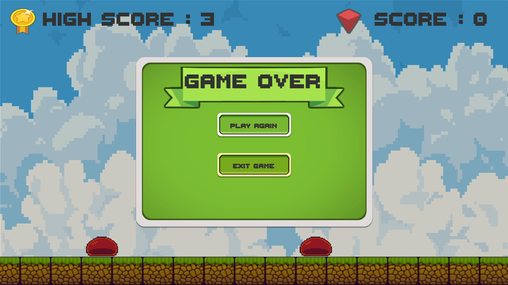

# EndlessRunnerUnity101 — 2D Side‑Scrolling Endless Runner (Unity 6)

> โปรเจกต์ตัวอย่างเพื่อการเรียนรู้ Unity 2D (Side‑Scrolling / Endless Runner). เหมาะสำหรับใส่ในพอร์ตโฟลิโอและใช้สาธิตกระบวนการทำเกมตั้งแต่ต้นจนจบ

  

---

## 🎮 เดโม / Demo

* **Live Demo (WebGL):** *(ใส่ลิงก์ GitHub Pages ที่นี่ ถ้ายังไม่มีให้ลบหัวข้อนี้)*
* **เวอร์ชันล่าสุด:** ดูที่ [Releases](./releases) *(หากใช้)*

> **หมายเหตุ:** Unity เวอร์ชันที่ใช้: **Unity 6 (ใส่เลขเวอร์ชันเต็มจาก `ProjectSettings/ProjectVersion.txt`)**

---

## ✨ ฟีเจอร์หลัก

* การควบคุมตัวละคร **วิ่ง/กระโดด** (Input System)
* เก็บ **เหรียญ (Coins)** พร้อม **คะแนน** และ **High Score (PlayerPrefs)**
* **Obstacle Spawner** และฉากเลื่อน (Texture Scroll)
* **Game Over UI** พร้อมเสียงเอฟเฟกต์ และ **เปลี่ยนเพลงพื้นหลังอัตโนมัติ**
* กล้องลื่นไหลด้วย **Cinemachine** และพิกเซลคมชัดด้วย **2D Pixel Perfect**
* โครงสร้างซีนง่ายต่อการต่อยอด และสคริปต์แยกหน้าที่ชัดเจน

---

## 🕹️ วิธีบังคับ / Controls

* **คลิกซ้าย (Mouse Left)**: กระโดด
* *(เพิ่มปุ่ม/ท่าทางอื่น ๆ ได้ตามโปรเจกต์)*

---

## 🧱 เทคโนโลยีที่ใช้

* **Unity 6** (2D URP/Core)
* **Packages:** Input System, 2D Tilemap, 2D Pixel Perfect, Cinemachine, TextMeshPro
* **Audio:** AudioSource, (ตัวเลือก) Audio Mixer + Snapshots
* **เวิร์กโฟลว์:** Git, GitHub, (ตัวเลือก) Git LFS สำหรับไฟล์ใหญ่

---

## 📸 สกรีนช็อต / สื่อประกอบ

> เก็บรูปในโฟลเดอร์ `docs/` แล้วแทรกตัวอย่างไว้ที่นี่

| Gameplay                       | Game Over                      | Icons                  |
| ------------------------------ | ------------------------------ | ---------------------- |
|  |  |  |

---

## 🗂️ โครงสร้างโปรเจกต์ (ย่อ)

```
Assets/
  Scenes/
  Scripts/
    Player/
    Enemies/
    Items/
    UI/
    Systems/
  Sprites/
  Audio/
Packages/
ProjectSettings/
```

---

## 🚀 เริ่มต้นใช้งาน (Getting Started)

### ความต้องการ

* **Unity Hub** และ **Unity 6** (ระบุเลขเวอร์ชันให้ตรง)

### วิธีเปิดโปรเจกต์

1. `Clone` หรือ `Download ZIP` รีโปนี้
2. เปิดผ่าน **Unity Hub** → Add project from disk → เลือกโฟลเดอร์โปรเจกต์
3. แนะนำตั้งค่า Unity (ถ้ายังไม่ตั้ง)

   * `Edit → Project Settings → Editor` → **Version Control = Visible Meta Files**, **Asset Serialization = Force Text**

### วิธี Build

* **Windows**: `File → Build Settings → PC, Mac & Linux Standalone → Windows` → Build
* **WebGL (สำหรับเดโม)**: เพิ่ม WebGL module → `File → Build Settings → WebGL` → Build → นำไฟล์ขึ้น GitHub Pages

---

## 🧪 จุดเด่นทางเทคนิค

* จัดการเสียง: **PlayOneShot** + แยก **BGM**/SFX, เปลี่ยนเพลงพื้นหลังเมื่อ GameOver, เฟดอิน/เฟดเอาต์
* ระบบ UI: อัปเดตคะแนนเรียลไทม์, GameOver UI แยกจาก Logic
* การเพิ่มประสิทธิภาพ: กรองไฟล์ด้วย `.gitignore`, รองรับ **Git LFS** สำหรับไฟล์ใหญ่

---

## 🛣️ Roadmap (วางแผนต่อยอด)

* [ ] เพิ่มศัตรูหลายประเภท / พฤติกรรม AI เบื้องต้น
* [ ] ระบบร้านค้า/อัปเกรดหลังจบด่าน
* [ ] ระบบภารกิจ/สถิติ
* [ ] อนิเมชันตัวละคร (Run/Jump/Attack) ด้วย Animator
* [ ] ปรับสมดุลความยากตามระยะทาง

---

## 📦 การจัดการไฟล์ใหญ่ (Git LFS)

หากในโปรเจกต์มีไฟล์เสียง/วิดีโอ/รูปใหญ่ ๆ แนะนำใช้ LFS:

```bash
# ทำครั้งเดียวในเครื่อง
git lfs install
# ติดตามนามสกุลไฟล์ใหญ่
git lfs track "*.wav" "*.mp3" "*.ogg" "*.psd" "*.mp4" "*.fbx" "*.tga"
# commit การเปลี่ยนแปลง
git add .gitattributes
git commit -m "Enable Git LFS"
```

---

## 🔖 License

โปรเจกต์นี้เสนอใช้ **MIT License** (เปลี่ยนได้ตามต้องการ) — ใส่ไฟล์ `LICENSE` ที่รากโปรเจกต์

---

## 🙏 เครดิต (Assets & Libraries)

> ใส่ที่มาของสไปรต์/เสียง/ฟอนต์ให้ครบ (สำคัญสำหรับพอร์ต/โอเพนซอร์ส)

* Character sprites: *ชื่อผู้สร้าง / ลิงก์*
* UI SFX / BGM: *ชื่อผู้สร้าง / ลิงก์*
* ไอคอน: *รูปที่ตัดแต่งจากสไปรต์ของโปรเจกต์*

---

## 👤 ผู้พัฒนา / Author

* **ชื่อ:** *ใส่ชื่อเต็มของคุณ*
* **อีเมลสำหรับสหกิจ:** *[example@email.com](mailto:example@email.com)*
* **GitHub:** [@TaridSuiz](https://github.com/TaridSuiz)
* **Portfolio:** *ลิงก์พอร์ตโฟลิโอถ้ามี*

> *Short English blurb:* A tiny 2D side‑scrolling endless runner built with Unity 6, showcasing input handling, score/highscore persistence, responsive camera, and audio transitions (SFX/BGM). Suitable for portfolio and internship applications.
